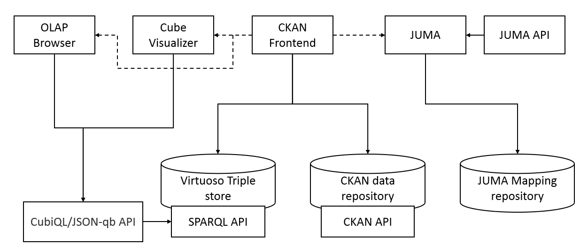
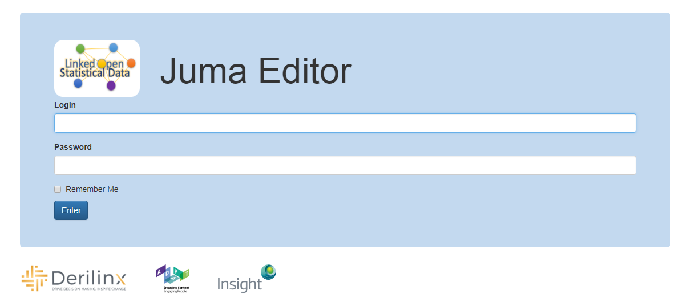
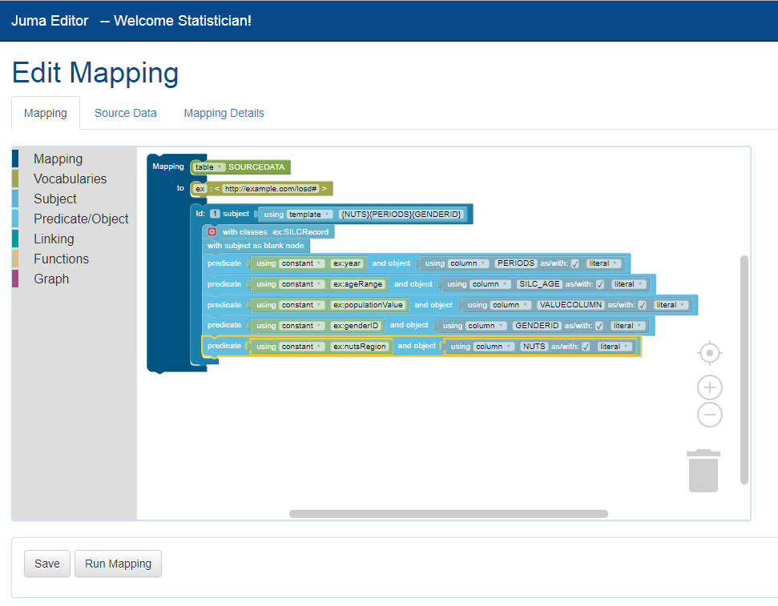
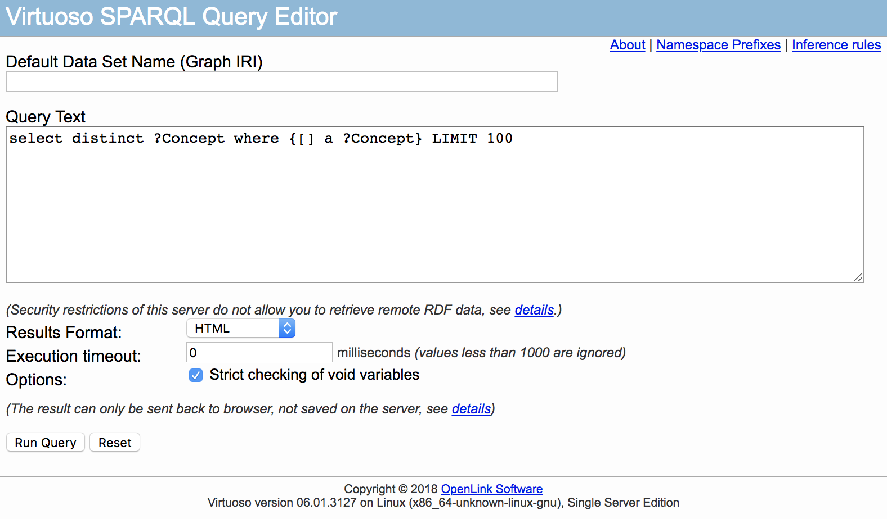
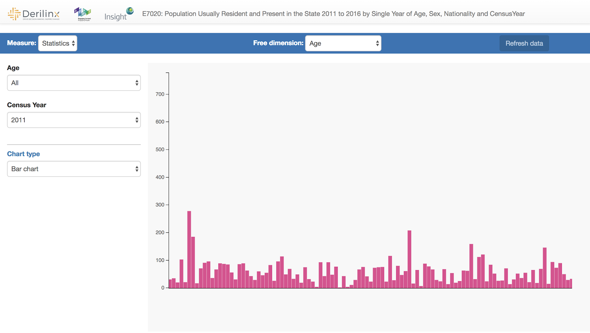
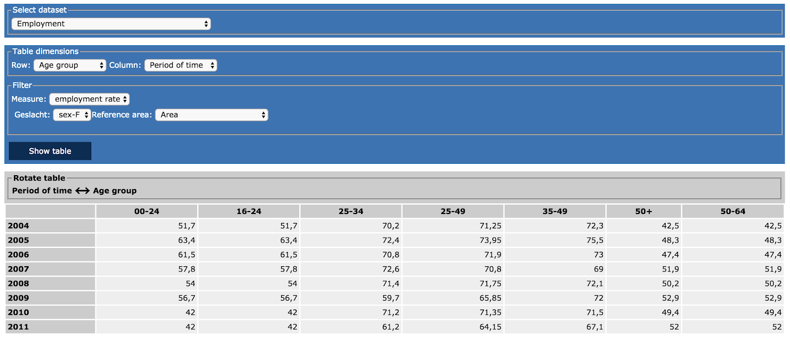

# Centralised LOSD Publication Platform

## Introduction

The Centralised LOSD Publication Platform is a set of tools that have been thoroughly studied and deployed/adapted by [Derilinx](https://derilinx.com/), [ADAPT](https://www.adaptcentre.ie/) and [Insight](https://www.insight-centre.org/) to form the LOSD publication pipeline: Data Cataloging, Conversion, Publishing, and Visualisation and Analysis.

The following Figure presents an overview of the various tools and their interactions. In the following, we will include details on these tools.

## CKAN the LOSD Data Hub

- *Description*: CKAN serves as a data catalog for datasets and resources used in the LOSD project. It is the first stop for using the rest the LOSD pipeline and to access datasets, Linked Data tools and training material.

- *Registration instructions*: Guest visitors can view the public content of CKAN but to add/edit datasets, users need to have an account. Users can register on their own as self registration is enabled. However, to be able to add datasets, users need to contact their organization’s administrator or Derilinx Team to be added as an editor.

## Juma the CSV to RDF mapping and conversion tool

- *Description*: Juma is a CSV to RDF mapping and conversion tool build on top of R2RML technology - which is a standard for the conversion of tabular data to RDF.. It allows users with little RDF knowledge to create their mappings using blocks.

- *Link*: http://losd.staging.derilinx.com:8888/juma-editor/login

- *Registration instructions*: Users require an account to use JUMA. Users need to contact ADAPT or Derilinx team to create an account.

## Virtuoso the RDF Store

- *Description*: Virtuoso has been added to the pipeline to make data exposed via a SPARQL endpoint. It hosts all the RDF data generated by the LOSD pipeline. Virtuoso not only provides a GUI which allows users to manually type queries and see the resulting data, it also provides an API for data access which is important for data access via applications.  

- *Link*: http://losd.staging.derilinx.com:8890/sparql

- *Account registration instructions*: Users do not need to register or have an account to use the LOSD SPARQL endpoint.

##Cube Visualizer the visualisation and analytics tool

- *Description*: Cube Visualizer is the cube visualization tool that serves also as a visual analytics tool. It allows user to create and present graphical visualisations of RDF data cube's one-dimensional slices. User can interact with User Interface by choosing measure, free dimension and dimension values, which later are transformed into appropriate API requests. Responses from the API are presented to user in a form of chart - bar chart, pie chart or area chart.

- *Link*: http://losd.staging.derilinx.com:8083/

- *Account registration instructions*: Users do not need to register or have an account to use Cube Visualizer.


## OLAP Browser the RDF Cube browser

- *Description*: The OLAP Browser enables performing OLAP (Online Analytical Processing) operations (e.g. pivot, drill-down, and roll-up) on top of multiple linked data cubes.

- *Link*: http://losd.staging.derilinx.com:8084/

- *Account registration instructions*: Users do not need to register or have an account to use OLAP Browser.

## Summary

All these tools are open source projects that have been customized for the LOSD publication pipeline. Documentation and details about these projects are included in D2.2 Recommended LOSD Service Implementation for NSOs in the ESS. User guides are captured as a set of courses that are made available in the LOSD Training platform: https://losd.staging.derilinx.com/moodle

